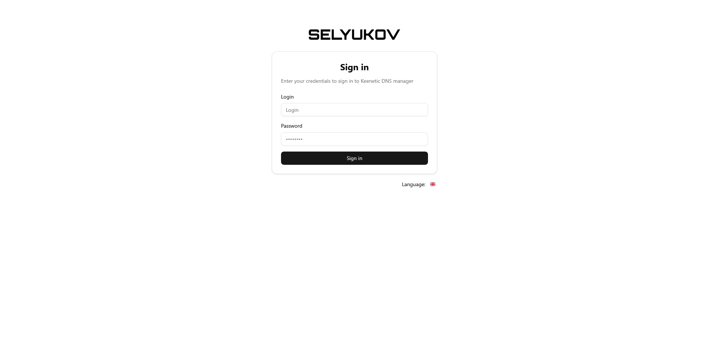
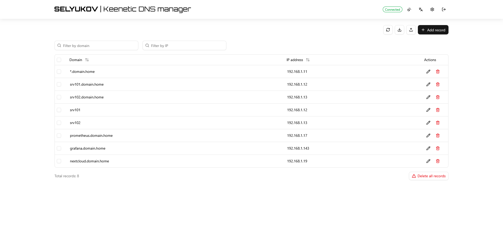
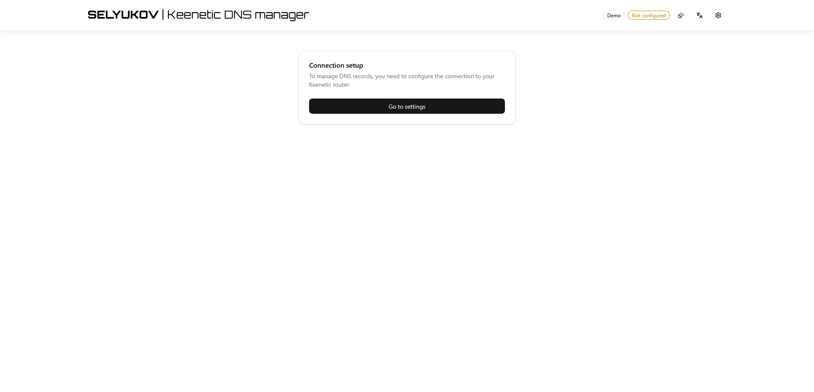
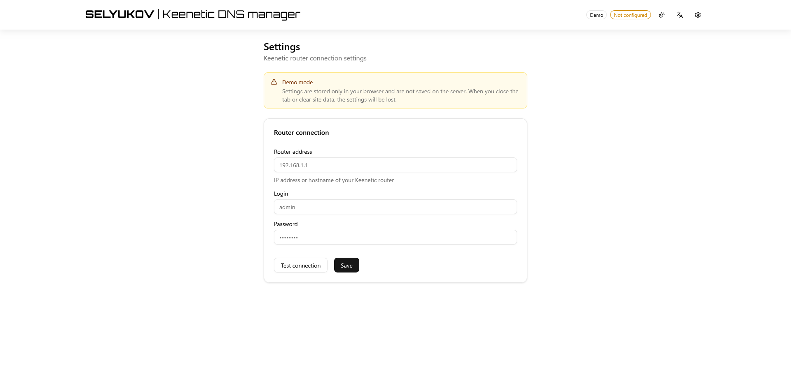

<p>
  
</p>

<p>
  <bold>SELYUKOV Keenetic DNS Manager</bold> – a web application for managing static DNS records on Keenetic routers. It will allow you to avoid installing a separate DNS server and will allow you to conveniently manage records through a web interface without using the command line.
</p>

<p>
  
  
  
  
  
</p>

---

<p>
  🇬🇧 English documentation | <a href="docs/ru/README_RU.md">🇷🇺 Документация на русском</a>
</p>

---

## ✨ Features

- 📋 **Full CRUD** — view, add, edit, and delete DNS records
- 📥 **Import / Export** — JSON format compatible with the Keenetic web console
- 🔍 **Search & Sort** — filter and sort records by domain or address
- 🔐 **Three operation modes** — `demo`, `no-auth`, `auth`
- 🌓 **Theming** — light, dark, and system themes
- 🌍 **i18n** — English and Russian UI
- 📊 **Prometheus metrics** — built-in `/metrics` endpoint
- 📝 **Structured logging** — via [pino](https://getpino.io/) with automatic secret masking
- 📱 **PWA-ready** — installable as a Progressive Web App

## 📸 Screenshots






## 🚀 Quick Start

### Prerequisites

- [Node.js](https://nodejs.org/) 20+
- A Keenetic router accessible over the network

### 1. Install dependencies

```bash
npm install
```

### 2. Configure environment

```bash
cp .env.example .env.local
```

Edit `.env.local` — see [Configuration](#-configuration) for details.

### 3. Run

```bash
# Development
npm run dev

# Production
npm run build && npm start
```

Open [http://localhost:3000](http://localhost:3000).

## 🐳 Docker

```bash
docker build -t keenetic-dns-manager .
docker run -p 3000:3000 --env-file .env.local keenetic-dns-manager
```

## 🔧 Configuration

All settings are managed via environment variables. Copy `.env.example` to `.env.local` as a starting point.

| Variable | Required | Description |
|---|---|---|
| `APP_MODE` | yes | Operation mode: `demo`, `no-auth`, `auth` |
| `KEENETIC_HOST` | no-auth / auth | Router IP or hostname |
| `KEENETIC_LOGIN` | no-auth / auth | Router login |
| `KEENETIC_PASSWORD` | no-auth / auth | Router password |
| `KEENETIC_COOKIE_PERSIST` | no | Persist router session cookies to file (`true` / `false`) |
| `AUTH_LOGIN` | auth | App login |
| `AUTH_PASSWORD` | auth | App password |
| `AUTH_JWT_SECRET` | auth | JWT secret (min 32 chars). Generate: `openssl rand -base64 32` |
| `METRICS_ENABLED` | no | Enable Prometheus metrics (default: `true`) |
| `METRICS_AUTH_ENABLED` | no | Protect `/metrics` with Basic Auth |
| `METRICS_AUTH_LOGIN` | no | Metrics auth login |
| `METRICS_AUTH_PASSWORD` | no | Metrics auth password |
| `LOG_LEVEL` | no | `debug` · `info` · `warn` · `error` (default: `info`) |
| `LOG_FORMAT` | no | `json` (production) · `pretty` (development) |

## 🔑 Operation Modes

### Demo (`APP_MODE=demo`)

Public demo mode for trying out the app or public use.

- Router credentials are entered in the browser and stored in `sessionStorage` (cleared when the tab closes)
- `KEENETIC_*` env variables are ignored
- Perfect for public deployments and showcases

### No-Auth (`APP_MODE=no-auth`)

Open access without authentication.

- Router credentials come from environment variables
- No login page
- Suitable for trusted networks or personal use

### Auth (`APP_MODE=auth`)

Protected mode with JWT authentication.

- Users must sign in with a login and password
- Session is stored in an `httpOnly` cookie
- Router credentials come from environment variables
- Recommended for production

## 📡 API Reference

### DNS Records

| Method | Endpoint | Description |
|---|---|---|
| `GET` | `/api/dns` | List all records |
| `POST` | `/api/dns` | Create record(s) |
| `PUT` | `/api/dns/[domain]` | Update a record |
| `DELETE` | `/api/dns/[domain]` | Delete a record |
| `DELETE` | `/api/dns?all=true` | Delete all records |

### System

| Method | Endpoint | Description |
|---|---|---|
| `GET` | `/api/health` | Health check |
| `GET` | `/metrics` | Prometheus metrics |
| `GET` | `/api/settings` | App settings |
| `POST` | `/api/auth/login` | Sign in (auth mode) |
| `POST` | `/api/auth/logout` | Sign out (auth mode) |
| `GET` | `/api/auth/me` | Current user |

## 📊 Prometheus Metrics

Available at `/metrics`:

```
keenetic_dns_records_total                   # Total DNS records
keenetic_dns_requests_total                  # API requests counter (labels: method, endpoint, status)
keenetic_dns_request_duration_seconds_bucket # Request duration histogram (labels: le, method, endpoint)
keenetic_dns_request_duration_seconds_sum    # Request duration histogram (labels: method, endpoint)
keenetic_dns_request_duration_seconds_count  # Request duration histogram (labels: method, endpoint)
keenetic_router_connected                    # Router connection status
keenetic_dns_app_info                        # App info (labels: version, mode)
```

Optionally protect with Basic Auth:

```env
METRICS_AUTH_ENABLED=true
METRICS_AUTH_LOGIN=prometheus
METRICS_AUTH_PASSWORD=secret
```

## 📥 Import & Export

The app supports importing and exporting DNS records as JSON, fully compatible with the Keenetic web console format:

```json
[
  { "address": "192.168.1.100", "domain": "server.local" },
  { "address": "192.168.1.101", "domain": "nas.local" }
]
```

## 📝 Logging

Powered by [pino](https://getpino.io/) with automatic secret masking (passwords, tokens, cookies).

| Format | Use case |
|---|---|
| `LOG_FORMAT=json` | Production — structured JSON logs |
| `LOG_FORMAT=pretty` | Development — human-readable output |

All server logs go to **stdout/stderr**. In Docker: `docker logs <container>`.

Browser errors (React components, hooks) are logged via `console.error()` and are visible in the browser's DevTools.

## 🛠️ Tech Stack

| Technology | Purpose |
|---|---|
| [Next.js 16](https://nextjs.org/) | React framework |
| [React 19](https://react.dev/) | UI library |
| [TypeScript 5](https://www.typescriptlang.org/) | Type safety |
| [Tailwind CSS 4](https://tailwindcss.com/) | Styling |
| [shadcn/ui](https://ui.shadcn.com/) | UI components |
| [SWR](https://swr.vercel.app/) | Data fetching & caching |
| [next-themes](https://github.com/pacocoursey/next-themes) | Theme management |
| [pino](https://getpino.io/) | Structured logging |
| [jose](https://github.com/panva/jose) | JWT tokens |
| [prom-client](https://github.com/siimon/prom-client) | Prometheus metrics |
| [Zod](https://zod.dev/) | Schema validation |
| [React Hook Form](https://react-hook-form.com/) | Form management |

## 📁 Project Structure

```
src/
├── app/                  # Next.js App Router
│   ├── api/              # API routes
│   ├── login/            # Login page
│   ├── settings/         # Settings page
│   └── metrics/          # Prometheus metrics endpoint
├── components/           # React components (+ shadcn/ui)
├── contexts/             # React contexts (i18n, app mode, demo)
├── hooks/                # Custom hooks
├── lib/                  # Utilities, config, Keenetic client, logger
└── types/                # TypeScript type definitions
public/                   # Images
```

## 🤝 Contributing

Contributions are welcome! Feel free to open issues and pull requests.

1. Fork the repository
2. Create a feature branch: `git checkout -b feature/amazing-feature`
3. Commit your changes: `git commit -m 'Add amazing feature'`
4. Push to the branch: `git push origin feature/amazing-feature`
5. Open a Pull Request

## 📄 License

This project is licensed under the [GNU General Public License v3.0](LICENSE).

---

Keenetic is a trademark of its respective owner. This project is an independent
third-party software developed to work with Keenetic devices. It is not
affiliated with, endorsed by, or sponsored by Keenetic.
