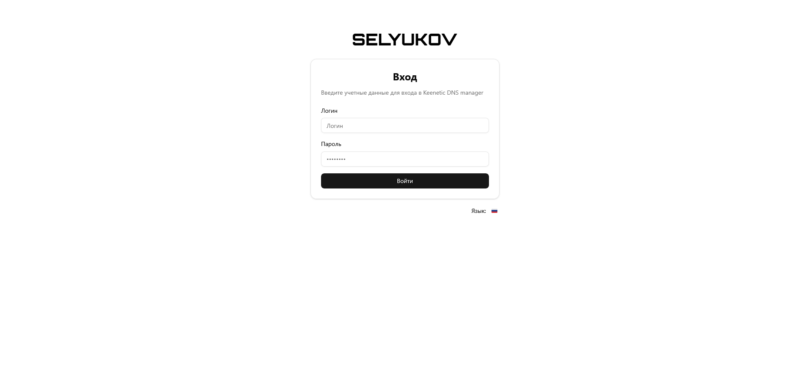
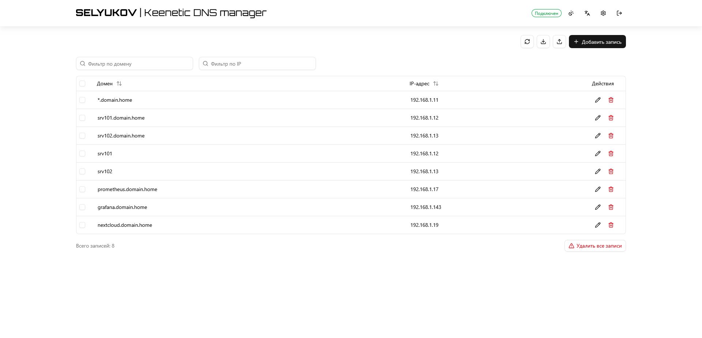
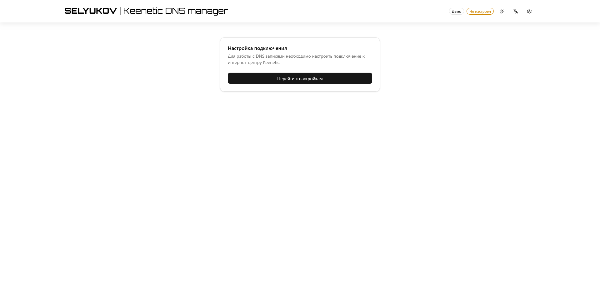
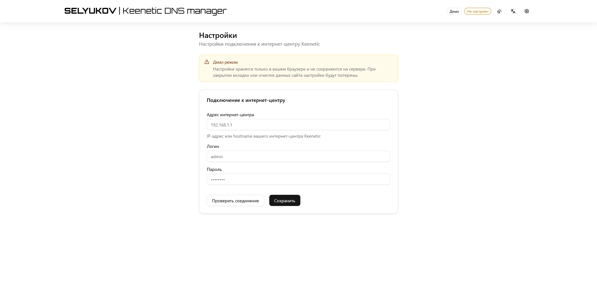

<p>
  
</p>

<p>
  <b>SELYUKOV Keenetic DNS Manager</b> – веб-приложение для управления статическими DNS-записями интернет-центра Keenetic. Оно позволит избежать установки отдельного DNS-сервера и даст возможность комфортно управлять записями через веб-интерфейс без использования коммандной строки.
</p>

<p>
  
  
  
  
  
</p>

---

<p>
  <a href="../../README.md">🇬🇧 English documentation</a> | 🇷🇺 Документация на русском
</p>

---

## ✨ Возможности

- 📋 **Полный CRUD** — просмотр, добавление, редактирование и удаление DNS-записей
- 📥 **Импорт / Экспорт** — формат JSON, совместимый с веб-консолью Keenetic
- 🔍 **Поиск и сортировка** — фильтрация записей по домену или адресу
- 🔐 **Три режима работы** — `demo`, `no-auth`, `auth`
- 🌓 **Темы оформления** — светлая, тёмная и системная
- 🌍 **Интернационализация** — интерфейс на английском и русском
- 📊 **Prometheus метрики** — встроенный эндпоинт `/metrics`
- 📝 **Структурированное логирование** — через [pino](https://getpino.io/) с автоматической маскировкой секретов
- 📱 **PWA** — можно установить как Progressive Web App

## 📸 Скриншоты






## 🚀 Быстрый старт

### Требования

- [Node.js](https://nodejs.org/) 20+
- Интернет-центр Keenetic, доступный по сети

### 1. Установите зависимости

```bash
npm install
```

### 2. Настройте окружение

```bash
cp .env.example .env.local
```

Отредактируйте `.env.local` — подробности в разделе [Конфигурация](#-конфигурация).

### 3. Запустите

```bash
# Разработка
npm run dev

# Продакшен
npm run build && npm start
```

Откройте [http://localhost:3000](http://localhost:3000).

## 🐳 Docker

Вы можете собрать образ самостоятельно:

```bash
docker build -t keenetic-dns-manager .
docker run -p 3000:3000 --env-file .env.local keenetic-dns-manager
```

или взять готовый из Docker Hub:

```bash
docker run -p 3000:3000 --env-file .env.local selyukov/keenetic-dns-manager:latest
```

Для запуска через Docker Compose можно воспользоваться примером [docker-compose.yml](../../deploy/docker/docker-compose.yml):

```bash
docker compose up -d
```

## 🔧 Конфигурация

Все параметры задаются через переменные окружения. Скопируйте `.env.example` в `.env.local`.

| Переменная | Обязательна | По умолчанию | Описание |
|---|---|---|---|
| `APP_MODE` | да | `demo` | Режим работы: `demo`, `no-auth`, `auth` |
| `KEENETIC_HOST` | no-auth / auth | — | IP-адрес или имя хоста интернет-центра |
| `KEENETIC_LOGIN` | no-auth / auth | — | Логин интернет-центра |
| `KEENETIC_PASSWORD` | no-auth / auth | — | Пароль интернет-центра |
| `KEENETIC_COOKIE_PERSIST` | нет | `false` | Сохранять куки сессии интернет-центра в файл (`true` / `false`) |
| `AUTH_LOGIN` | auth | — | Логин для входа в приложение |
| `AUTH_PASSWORD` | auth | — | Пароль для входа в приложение |
| `AUTH_JWT_SECRET` | auth | — | Секрет JWT (мин. 32 символа). Сгенерировать: `openssl rand -base64 32` |
| `METRICS_ENABLED` | нет | `true` | Включить Prometheus метрики |
| `METRICS_AUTH_ENABLED` | нет | `false` | Защитить `/metrics` через Basic Auth |
| `METRICS_AUTH_LOGIN` | нет | — | Логин для метрик |
| `METRICS_AUTH_PASSWORD` | нет | — | Пароль для метрик |
| `LOG_LEVEL` | нет | `info` | `debug`, `info`, `warn`, `error` |
| `LOG_FORMAT` | нет | `json` | `json` (продакшен) · `pretty` (разработка) |

## 🔑 Режимы работы

### Демо (`APP_MODE=demo`)

Публичный демо-режим для ознакомления с приложением или общего ипользования.

- Учётные данные интернет-центра вводятся в браузере и хранятся в `sessionStorage` (очищаются при закрытии вкладки)
- Переменные окружения сервера `KEENETIC_*` игнорируются
- Идеально для публичных демонстраций или общего ипользования

### No-Auth (`APP_MODE=no-auth`)

Открытый доступ без авторизации.

- Учётные данные интернет-центра берутся из переменных окружения
- Нет страницы логина
- Подходит для доверенных сетей или личного использования

### Auth (`APP_MODE=auth`)

Защищённый режим с JWT-авторизацией.

- Для доступа необходимо войти с логином и паролем
- Сессия хранится в `httpOnly` cookie
- Учётные данные интернет-центра берутся из переменных окружения сервера
- Рекомендуется для продакшена

## 📡 API

### DNS-записи

| Метод | Эндпоинт | Описание |
|---|---|---|
| `GET` | `/api/dns` | Получить все записи |
| `POST` | `/api/dns` | Создать запись(и) |
| `PUT` | `/api/dns/[domain]` | Обновить запись |
| `DELETE` | `/api/dns/[domain]` | Удалить запись |
| `DELETE` | `/api/dns?all=true` | Удалить все записи |

### Система

| Метод | Эндпоинт | Описание |
|---|---|---|
| `GET` | `/api/health` | Проверка состояния |
| `GET` | `/metrics` | Prometheus метрики |
| `GET` | `/api/settings` | Настройки приложения |
| `POST` | `/api/auth/login` | Вход (режим auth) |
| `POST` | `/api/auth/logout` | Выход (режим auth) |
| `GET` | `/api/auth/me` | Текущий пользователь |

## 📊 Prometheus метрики

Доступны по адресу `/metrics`:

```
keenetic_dns_records_total                   # Количество DNS-записей
keenetic_dns_requests_total                  # Счётчик API-запросов (метки: method, endpoint, status)
keenetic_dns_request_duration_seconds_bucket # Гистограмма времени запросов (метки: le, method, endpoint)
keenetic_dns_request_duration_seconds_sum    # Гистограмма времени запросов (метки: method, endpoint)
keenetic_dns_request_duration_seconds_count  # Гистограмма времени запросов (метки: method, endpoint)
keenetic_router_connected                    # Статус подключения к интернет-центру
keenetic_dns_app_info                        # Информация о приложении (метки: version, mode)
```

Опциональная защита через Basic Auth:

```env
METRICS_AUTH_ENABLED=true
METRICS_AUTH_LOGIN=prometheus
METRICS_AUTH_PASSWORD=secret
```

Пример для сбора метрик:

```yaml
- job_name: keenetic-dns-manager
  metrics_path: /metrics
  basic_auth:
    username: prometheus
    password: prometheus
  scheme: http
  static_configs:
    - targets:
      - localhost:3000
```

Пример дашборда Grafana: [dashboard.json](../../deploy/grafana/dashboard.json)

## 📥 Импорт и экспорт

Приложение поддерживает импорт и экспорт DNS-записей в формате JSON, полностью совместимом с веб-консолью Keenetic:

```json
[
  { "address": "192.168.1.100", "domain": "server.local" },
  { "address": "192.168.1.101", "domain": "nas.local" }
]
```

## 📝 Логирование

Работает на [pino](https://getpino.io/) с автоматической маскировкой секретов (пароли, токены, куки).

| Формат | Назначение |
|---|---|
| `LOG_FORMAT=json` | Продакшен — структурированные JSON-логи |
| `LOG_FORMAT=pretty` | Разработка — человекочитаемый вывод |

Все серверные логи идут в **stdout/stderr**. В Docker: `docker logs <container>`.

Браузерные ошибки (React компоненты, хуки) логируются через `console.error()` и видны в DevTools браузера.

## 🛠️ Технологии

| Технология | Назначение |
|---|---|
| [Next.js 16](https://nextjs.org/) | React-фреймворк |
| [React 19](https://react.dev/) | UI-библиотека |
| [TypeScript 5](https://www.typescriptlang.org/) | Типизация |
| [Tailwind CSS 4](https://tailwindcss.com/) | Стилизация |
| [shadcn/ui](https://ui.shadcn.com/) | UI-компоненты |
| [SWR](https://swr.vercel.app/) | Загрузка и кеширование данных |
| [next-themes](https://github.com/pacocoursey/next-themes) | Управление темами |
| [pino](https://getpino.io/) | Структурированное логирование |
| [jose](https://github.com/panva/jose) | JWT-токены |
| [prom-client](https://github.com/siimon/prom-client) | Prometheus метрики |
| [Zod](https://zod.dev/) | Валидация схем |
| [React Hook Form](https://react-hook-form.com/) | Управление формами |

## 📁 Структура проекта

```
src/
├── app/                  # Next.js App Router
│   ├── api/              # API-маршруты
│   ├── login/            # Страница входа
│   ├── settings/         # Страница настроек
│   └── metrics/          # Эндпоинт Prometheus метрик
├── components/           # React-компоненты (+ shadcn/ui)
├── contexts/             # React-контексты (i18n, app mode, demo)
├── hooks/                # Пользовательские хуки
├── lib/                  # Утилиты, конфиг, Keenetic-клиент, логгер
└── types/                # Определения типов TypeScript
public/                   # Изображения
```

## 🤝 Участие в разработке

Приветствуются любые вклады! Не стесняйтесь открывать issues и pull requests.

1. Сделайте форк репозитория
2. Создайте ветку для фичи: `git checkout -b feature/amazing-feature`
3. Зафиксируйте изменения: `git commit -m 'Add amazing feature'`
4. Отправьте ветку: `git push origin feature/amazing-feature`
5. Откройте Pull Request

## 📄 Лицензия

Проект распространяется под лицензией [GNU General Public License v3.0](../../LICENSE).

---

Keenetic является товарным знаком соответствующего владельца. Данный проект представляет собой
независимое программное обеспечение стороннего разработчика, предназначенное для работы
с устройствами Keenetic. Он не связан с компанией Keenetic и не спонсируется ею.
